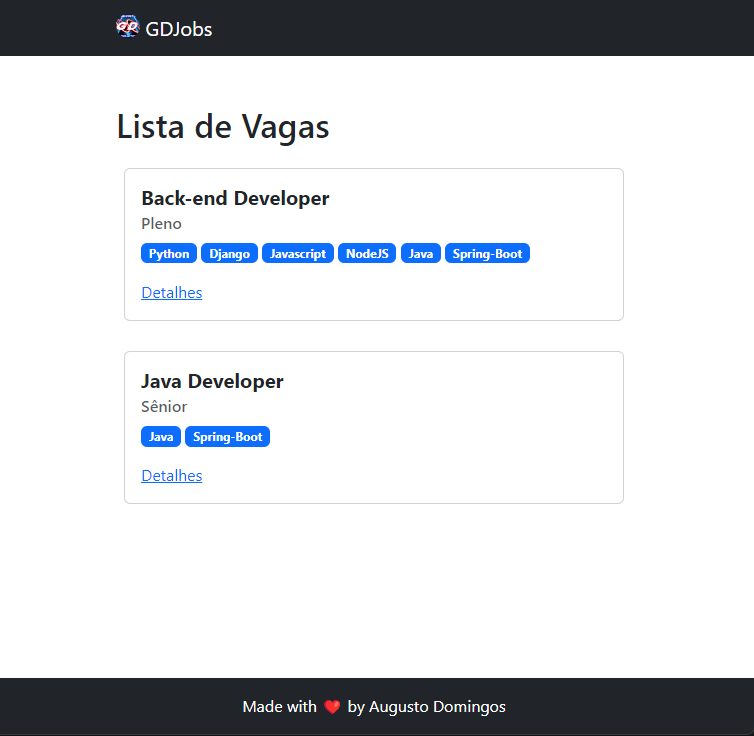

# Simulador de Entrevista com IA

Um simulador de entrevista baseado em IA construído em Django usando a API do Gemini da Google. Atualmente em fazes iniciais, mas o suficiente para testar e rodar em sua máquina.

## Instalação e Configuração

1. Clone este repositório.
2. Crie um ambiente virtual e ative-o.
3. Instale as dependências usando `pip install -r requirements.txt`.
4. Crie um arquivo  **.env** no diretorio root do seu projeto com as seguintes variaveis:
```env
SECRET_KEY = sua secret_key gerada
DEBUG = true ou false
ALLOWED_HOSTS: lista de domínios ou IPs permitidos para acessar o projeto
GEMINI_API_KEY = sua api_key da gemini
GEMINI_AI_BASE_URL = base url da gemini
```
6. Execute as migrações: `python manage.py makemigrations`, `python manage.py migrate`.
7. Crie um superusuário para acesso ao painel de administração: `python manage.py createsuperuser`.
8. Inicie o servidor de desenvolvimento: `python manage.py runserver`.

## Como Funciona?
Usando a rota `/admin`, você pode criar lista de vagas preenchendo o **título**, a **descrição**, os **requisitos** e as **responsabilidades** de cada vaga.

Após adicionar essas vagas, acesse a rota `/jobs` para começar a simular entrevistas para a vaga de sua escolha. O frontend já possui um chat onde você vai interagir com a IA.




## Contribuição

Sinta-se à vontade para contribuir com o projeto


